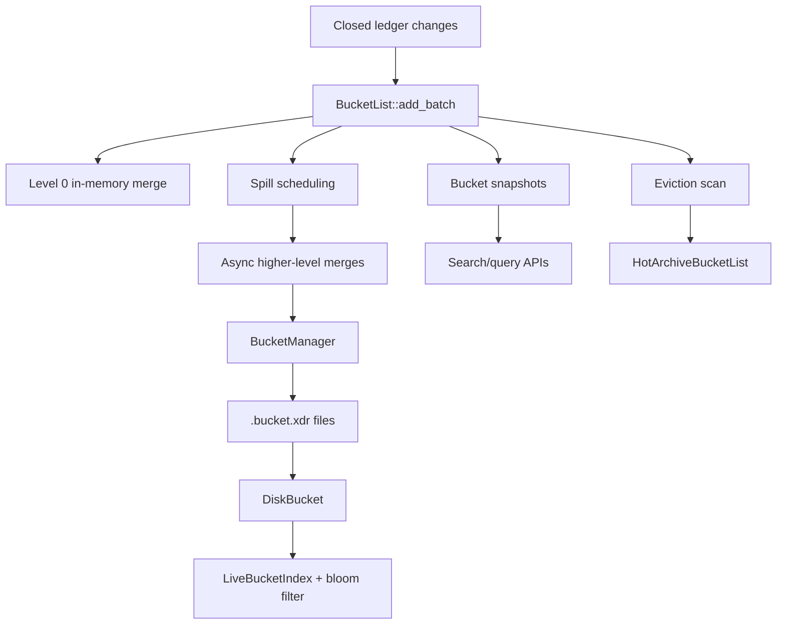

# henyey-bucket

BucketList storage, merging, indexing, and archival for Stellar ledger state.

## Overview

`henyey-bucket` implements Stellar's bucket subsystem: immutable bucket files, the 11-level live `BucketList`, the 11-level hot-archive bucket list for archived Soroban state, disk-backed indexing for large buckets, and the snapshot/query helpers used by catchup and state inspection. It is the Rust counterpart to `stellar-core/src/bucket/`, and sits between ledger-state producers/consumers and the on-disk bucket files managed by `BucketManager`.

## Architecture



## Key Types

| Type | Description |
|------|-------------|
| `BucketEntry` | XDR bucket entry enum: live, dead, init, or metadata. |
| `Bucket` | Immutable live bucket with in-memory or disk-backed storage. |
| `BucketLevel` | One live bucket-list level containing `curr`, `snap`, and pending merge state. |
| `BucketList` | Full 11-level live bucket list for canonical ledger state. |
| `HotArchiveBucket` | Immutable bucket for archived Soroban entries and restore markers. |
| `HotArchiveBucketList` | 11-level hot-archive bucket list used for persistent Soroban archival. |
| `BucketManager` | Owns bucket files on disk, cacheing, loading, merge output promotion, and GC. |
| `DiskBucket` | Mmap-backed live bucket reader with on-demand entry loads. |
| `LiveBucketIndex` | Facade over `InMemoryIndex` and `DiskIndex` for fast lookups and scans. |
| `FutureBucket` | Serializable future-merge wrapper used for HAS-compatible restart/reattach flows. |
| `BucketSnapshotManager` | Thread-safe holder for current and historical live/hot-archive snapshots. |
| `SearchableBucketListSnapshot` | Query wrapper for point lookups, batch loads, pool scans, and inflation queries. |
| `BucketApplicator` | Chunked catchup applicator that deduplicates entries before DB writes. |
| `BucketMergeMap` | Completed-merge map used for merge deduplication and reattachment. |
| `MergeCounters` | Atomic counters for merge timing and merge-behavior statistics. |

## Usage

### Add a ledger batch and query the result

```rust
use henyey_bucket::BucketList;
use stellar_xdr::curr::{BucketListType, LedgerEntry, LedgerKey};

let mut bucket_list = BucketList::new();

bucket_list.add_batch(
    ledger_seq,
    protocol_version,
    BucketListType::Live,
    init_entries,   // Vec<LedgerEntry>
    live_entries,   // Vec<LedgerEntry>
    dead_entries,   // Vec<LedgerKey>
)?;

let entry: Option<LedgerEntry> = bucket_list.get(&some_key)?;
```

### Merge buckets explicitly

```rust
use henyey_bucket::{merge_buckets, MergeOptions, DeadEntryPolicy, InitEntryPolicy};

let merged = merge_buckets(
    &old_bucket,
    &new_bucket,
    &MergeOptions {
        keep_dead_entries: DeadEntryPolicy::Keep,
        max_protocol_version: 25,
        normalize_init_entries: InitEntryPolicy::Preserve,
        ..Default::default()
    },
)?;
```

### Stream live entries or run an eviction scan

```rust
use std::collections::HashSet;

use henyey_bucket::{
    default_state_archival_settings, EvictionIterator, EvictionIteratorExt,
};

for entry in bucket_list.live_entries_iter() {
    let entry = entry?;
    // process entry
}

let mut settings = default_state_archival_settings();
settings.eviction_scan_size = 100_000;

let scan = bucket_list.scan_for_eviction_incremental(
    EvictionIterator::with_default_level(),
    current_ledger,
    &settings,
)?;

let resolved = scan.resolve(settings.max_entries_to_archive, &HashSet::new());
```

## Module Layout

| Module | Description |
|--------|-------------|
| `lib.rs` | Crate root and public re-exports. |
| `applicator.rs` | Chunked bucket application during catchup. |
| `bloom_filter.rs` | Binary fuse filter wrapper for fast negative lookups. |
| `bucket.rs` | Core live `Bucket` type and in-memory/disk-backed storage abstraction. |
| `bucket_list.rs` | Live bucket-list levels, spill logic, lookups, scans, and merge orchestration. |
| `cache.rs` | Random-eviction per-bucket cache for account entries. |
| `disk_bucket.rs` | Streaming/mmap reader and lookup implementation for large bucket files. |
| `entry.rs` | `BucketEntry` helpers, ordering, and Soroban TTL/eviction utilities. |
| `error.rs` | `BucketError` definitions. |
| `eviction.rs` | Eviction iterator math, settings helpers, and scan-resolution types. |
| `future_bucket.rs` | Serializable future-merge state and merge reattachment helpers. |
| `hot_archive.rs` | Hot-archive bucket type, merge semantics, and hot-archive bucket list. |
| `index.rs` | In-memory and page-based disk indexes plus counters and pool mappings. |
| `index_persistence.rs` | Serialization of `DiskIndex` sidecar `.index` files. |
| `iterator.rs` | Legacy gzip-based streaming iterators and merge-input helpers. |
| `live_iterator.rs` | Streaming deduplicated iteration over live entries in a bucket list. |
| `manager.rs` | Bucket file lifecycle management, caching, loading, merging, and cleanup. |
| `merge.rs` | Two-way merge logic, CAP-0020 semantics, and streaming merge-to-file paths. |
| `merge_map.rs` | Completed/in-flight merge tracking for deduplication. |
| `metrics.rs` | Merge, eviction, and bucket-list metric counters. |
| `snapshot.rs` | Thread-safe live and hot-archive snapshot/query types. |

## Design Notes

- Level 0 is special: it keeps in-memory entry vectors so the hottest merge path avoids disk I/O, while higher levels spill through background merges.
- The canonical on-disk format is uncompressed `.bucket.xdr` with XDR record marks; disk-backed buckets and index persistence are built around that format.
- Eviction is intentionally two-phase: the scan collects candidates within a byte budget, and `EvictionResult::resolve()` later applies modified-key filtering and `max_entries_to_archive` limits to match stellar-core sequencing.

## stellar-core Mapping

| Rust | stellar-core |
|------|--------------|
| `bucket.rs` | `src/bucket/Bucket.cpp`, `src/bucket/LiveBucket.cpp` |
| `bucket_list.rs` | `src/bucket/BucketList.cpp`, `src/bucket/LiveBucketList.cpp` |
| `manager.rs` | `src/bucket/BucketManager.cpp` |
| `entry.rs` | `src/bucket/BucketUtils.h`, `src/bucket/LedgerCmp.h` |
| `merge.rs` | `src/bucket/Bucket.cpp`, `src/bucket/LiveBucket.cpp` |
| `hot_archive.rs` | `src/bucket/HotArchiveBucket.cpp`, `src/bucket/HotArchiveBucketList.cpp` |
| `snapshot.rs` | `src/bucket/BucketSnapshotManager.cpp`, `src/bucket/SearchableBucketListSnapshot.cpp` |
| `index.rs` | `src/bucket/LiveBucketIndex.cpp`, `src/bucket/DiskIndex.cpp`, `src/bucket/InMemoryIndex.cpp` |
| `index_persistence.rs` | `src/bucket/BucketIndexUtils.cpp` |
| `disk_bucket.rs` | `src/bucket/BucketIndex.cpp` |
| `future_bucket.rs` | `src/bucket/FutureBucket.cpp` |
| `iterator.rs` | `src/bucket/BucketInputIterator.cpp`, `src/bucket/BucketOutputIterator.cpp` |
| `applicator.rs` | `src/bucket/BucketApplicator.cpp` |
| `merge_map.rs` | `src/bucket/BucketMergeMap.cpp` |
| `cache.rs` | `src/util/RandomEvictionCache.h` |
| `metrics.rs` | `src/bucket/BucketUtils.h`, `src/bucket/BucketListBase.h` |
| `eviction.rs` | `src/bucket/BucketListBase.cpp` |
| `bloom_filter.rs` | `src/bucket/BinaryFuseFilter.h` |
| `live_iterator.rs` | `src/bucket/BucketApplicator.cpp` |

## Parity Status

See [PARITY_STATUS.md](PARITY_STATUS.md) for detailed stellar-core parity analysis.
