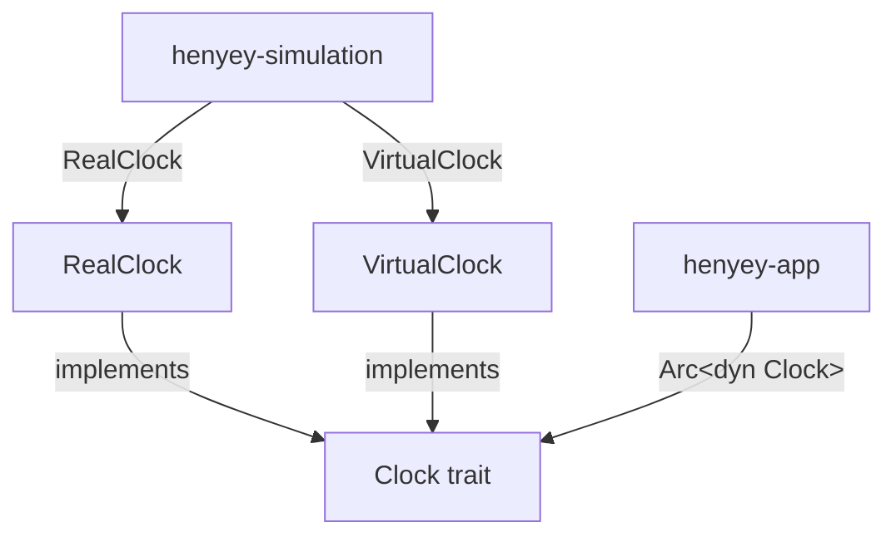

# henyey-clock

Clock abstractions for monotonic timing, async sleep, and periodic intervals.

## Overview

`henyey-clock` provides a `Clock` trait and two concrete implementations that
decouple timing-sensitive logic from direct wall-clock calls. By injecting a
clock into higher-level components (`henyey-app`, `henyey-simulation`), the
system can run against real time in production or against a controllable virtual
clock in simulation and test harnesses. The crate corresponds to the
`VirtualClock` facility in stellar-core's `src/util/Timer.h`.

## Architecture



## Key Types

| Type | Description |
|------|-------------|
| `Clock` | Trait providing `now`, `system_now`, `sleep`, and `interval` |
| `RealClock` | Production implementation backed by `std::time::Instant` and `tokio::time` |
| `VirtualClock` | Simulation clock with a configurable base instant for controlled time progression |

## Usage

### Basic production clock

```rust
use henyey_clock::{Clock, RealClock};
use std::time::Duration;

let clock = RealClock;
let t1 = clock.now();
// ... do work ...
let elapsed = t1.elapsed();
```

### Async sleep and interval

```rust
use henyey_clock::{Clock, RealClock};
use std::time::Duration;
use futures::StreamExt;

let clock = RealClock;

// One-shot sleep
clock.sleep(Duration::from_secs(1)).await;

// Periodic interval
let mut ticks = clock.interval(Duration::from_millis(500));
while let Some(()) = ticks.next().await {
    // runs every 500ms
}
```

### Virtual clock for simulation

```rust
use henyey_clock::{Clock, VirtualClock};
use std::time::{Duration, Instant};

let mut clock = VirtualClock::new();
// Shift the base instant to simulate time having passed
clock.set_base_instant(Instant::now() - Duration::from_secs(60));
let now = clock.now(); // reflects the shifted base
```

## Module Layout

| Module | Description |
|--------|-------------|
| `lib.rs` | `Clock` trait definition, `RealClock` and `VirtualClock` implementations, unit tests |

## Design Notes

- `VirtualClock::now()` computes time as `base_instant + base_instant.elapsed()`.
  This means it still advances with real wall-clock time but from a shifted
  origin. It does **not** freeze time — callers that need a frozen instant should
  capture the return value of `now()`.
- `sleep` and `interval` have default implementations on the trait that delegate
  to `tokio::time`, so all implementors get async timing for free.
- The crate deliberately avoids interior mutability; `set_base_instant` takes
  `&mut self`, keeping clock mutation explicit and visible at the call site.

## stellar-core Mapping

| Rust | stellar-core |
|------|--------------|
| `Clock` trait | `VirtualClock` class (`src/util/Timer.h`) — the trait captures the timing interface that stellar-core's `VirtualClock` exposes |
| `RealClock` | `VirtualClock` in `REAL_TIME` mode |
| `VirtualClock` | `VirtualClock` in `VIRTUAL_TIME` mode |

## Parity Status

See [PARITY_STATUS.md](PARITY_STATUS.md) for detailed stellar-core parity analysis.
