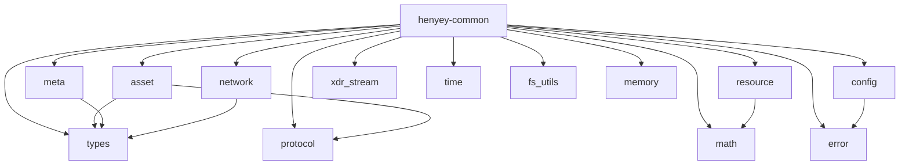

# henyey-common

Common types, protocol helpers, and shared utilities used across the henyey workspace.

## Overview

`henyey-common` is the dependency-light foundation crate for the rest of the workspace. It collects reusable protocol-facing types (`Hash256`, `NetworkId`, `ProtocolVersion`), shared arithmetic and resource-accounting helpers, configuration structs, deterministic metadata normalization, and a few carefully scoped I/O helpers such as crash-safe rename and size-prefixed XDR streaming. For stellar-core parity work, it primarily maps to utilities under `stellar-core/src/util/`, plus pieces of `src/main/Config.*` and `src/util/XDRStream.h`.

## Architecture



## Key Types

| Type | Description |
|------|-------------|
| `Hash256` | Canonical 32-byte SHA-256 hash wrapper used for ledger, transaction, and network identifiers |
| `NetworkId` | Hash of a network passphrase used to bind signatures and transactions to a specific network |
| `Config` | Top-level TOML-deserializable node configuration |
| `BucketListDbConfig` | BucketListDB indexing, caching, and persistence settings |
| `Error` | Shared crate-level error enum for XDR, I/O, config, validation, and generic operation failures |
| `ProtocolVersion` | Type-safe representation of protocol versions `V0` through `V25` |
| `Resource` | Variable-width transaction resource vector for classic and Soroban accounting |
| `ResourceType` | Named indexes for the seven Soroban resource dimensions |
| `Rounding` | Rounding direction for big-division helpers |
| `MathError` | Overflow, divide-by-zero, and negative-input errors for arithmetic helpers |
| `XdrOutputStream` | Buffered writer for stellar-core-compatible size-prefixed XDR frames |
| `DurableXdrOutputStream` | XDR frame writer that flushes and fsyncs each entry for crash safety |
| `XdrInputStream` | Reader for the same framed XDR format used by stellar-core streams |
| `MemoryEstimate` | Trait for O(1) approximate heap accounting of components |
| `ComponentMemory` | Named memory measurement used for reporting heap or file-backed component usage |

## Usage

### Hashing and network identity

```rust
use henyey_common::{Hash256, NetworkId};

let hash = Hash256::hash(b"hello world");
assert!(!hash.is_zero());

let testnet = NetworkId::testnet();
let mainnet = NetworkId::mainnet();
assert_ne!(testnet.as_bytes(), mainnet.as_bytes());
```

### Protocol gating and resource scaling

```rust
use henyey_common::math::Rounding;
use henyey_common::protocol::{protocol_version_starts_from, ProtocolVersion};
use henyey_common::resource::{big_divide_resource, Resource, ResourceType};

let mut used = Resource::make_empty_soroban();
used.set_val(ResourceType::Operations, 1);
used.set_val(ResourceType::Instructions, 2_500_000);

if protocol_version_starts_from(25, ProtocolVersion::V23) {
    let scaled = big_divide_resource(&used, 3, 2, Rounding::Up).unwrap();
    assert!(scaled.get_val(ResourceType::Instructions) >= 3_750_000);
}
```

### Loading shared node configuration

```rust
use henyey_common::Config;

let config = Config::testnet();
assert_eq!(config.network.peer_port, 11625);
assert!(config.bucket_list_db.page_size_bytes() >= 16 * 1024);
assert!(!config.node.is_validator);
```

## Module Layout

| Module | Description |
|--------|-------------|
| `lib.rs` | Crate root that exposes modules and re-exports commonly used items plus `stellar_xdr` |
| `asset.rs` | Asset validation, asset-code conversion, issuer lookups, trustline conversion, and balance helpers |
| `config.rs` | Node, network, history archive, logging, quorum-set, and BucketListDB configuration structs |
| `error.rs` | Shared `Error` enum and `Result<T>` alias |
| `fs_utils.rs` | Crash-safe filesystem helpers, currently centered on durable rename |
| `math.rs` | Big-division, multiplication, square-root, and conversion helpers with explicit overflow handling |
| `memory.rs` | Approximate heap-accounting trait and collection sizing helpers |
| `meta.rs` | Canonical sorting of transaction metadata ledger-entry changes for deterministic hashing |
| `network.rs` | Network passphrase hashing and helpers for standard Stellar networks |
| `protocol.rs` | Protocol version enum, constants, and feature-gating helpers |
| `resource.rs` | Multi-dimensional resource vectors and arithmetic used by surge-pricing logic |
| `time.rs` | Unix/Stellar epoch conversion helpers and current timestamp utilities |
| `types.rs` | `Hash256`, `ThresholdLevel`, deterministic seed derivation, and ledger-entry key extraction |
| `xdr_stream.rs` | Framed XDR readers/writers compatible with stellar-core's file stream format |

## Design Notes

- `Resource` uses a `Vec<i64>` rather than a fixed array because henyey needs to represent three valid widths: classic (1), classic-plus-bytes (2), and Soroban (7).
- `meta.rs` sorts ledger changes by encoded key, change kind, and change hash so metadata hashing stays deterministic even if execution order differs between nodes.
- `DurableXdrOutputStream` is intentionally separate from `XdrOutputStream` so crash-safe fsync semantics are a type-level choice instead of a runtime flag.
- `asset.rs` intentionally groups several small stellar-core helpers into one module to stay close to upstream file organization during parity work.

## stellar-core Mapping

| Rust | stellar-core |
|------|--------------|
| `types.rs` | `src/util/types.h`, `src/util/HashOfHash.h` |
| `math.rs` | `src/util/numeric.h`, `src/util/numeric.cpp`, `src/util/numeric128.h` |
| `protocol.rs` | `src/util/ProtocolVersion.h`, `src/util/ProtocolVersion.cpp` |
| `asset.rs` | `src/util/types.h`, `src/util/types.cpp`, `src/transactions/TransactionUtils.h`, `src/transactions/TransactionUtils.cpp` |
| `resource.rs` | `src/util/TxResource.h`, `src/util/TxResource.cpp` |
| `meta.rs` | `src/util/MetaUtils.h`, `src/util/MetaUtils.cpp` |
| `network.rs` | `src/main/Config.h` (network passphrase hashing) |
| `config.rs` | `src/main/Config.h`, `src/main/Config.cpp` |
| `error.rs` | Rust-native (no direct stellar-core equivalent) |
| `time.rs` | `src/util/Timer.h`, `src/util/Timer.cpp` (subset) |
| `memory.rs` | Rust-native (no direct stellar-core equivalent) |
| `fs_utils.rs` | `src/util/Fs.h`, `src/util/Fs.cpp` (`durableRename`) |
| `xdr_stream.rs` | `src/util/XDRStream.h` |

## Parity Status

See [PARITY_STATUS.md](PARITY_STATUS.md) for detailed stellar-core parity analysis.
