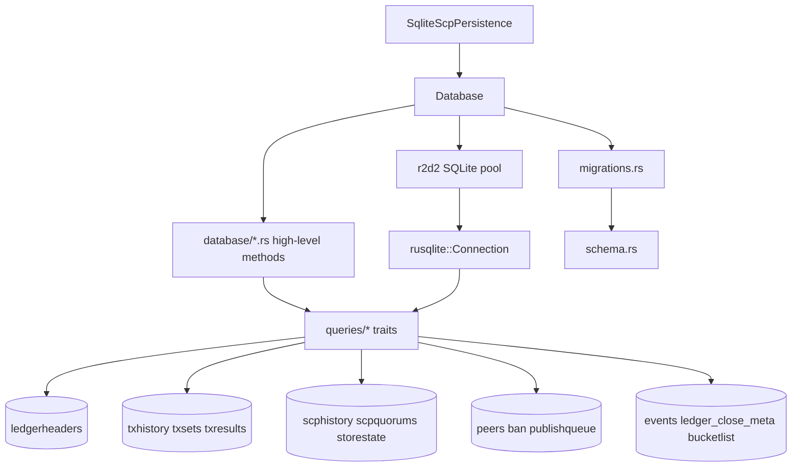

# henyey-db

SQLite persistence layer for henyey node state, history, and RPC data.

## Overview

`henyey-db` centralizes all on-disk persistence for a running henyey node. It owns schema creation and migrations, configures SQLite connection pooling, and exposes domain-specific query traits plus higher-level `Database` convenience methods for ledger headers, transaction history, SCP persistence, peers, publish queue state, and RPC-oriented retention tables. It mostly corresponds to stellar-core's `src/database/` support code plus the SQL logic spread through `src/ledger/`, `src/transactions/`, `src/herder/`, `src/overlay/`, `src/main/`, and `src/history/`.

## Architecture



## Key Types

| Type | Description |
|------|-------------|
| `Database` | Cloneable pooled database handle with initialization, transaction, and convenience APIs |
| `DbError` | Unified error enum for SQLite, pool, migration, I/O, integrity, and XDR failures |
| `SqliteScpPersistence` | Adapter used by herder code to persist SCP slot state and tx sets in SQLite |
| `LedgerQueries` | Trait for storing, loading, streaming, and pruning ledger headers |
| `HistoryQueries` | Trait for transaction records, tx-set history, tx-result history, pagination, and cleanup |
| `ScpQueries` | Trait for SCP envelopes, quorum sets, history streaming, and cleanup |
| `ScpStatePersistenceQueries` | Trait for persisted SCP slot state and tx-set crash recovery data |
| `StateQueries` | Trait for generic `storestate` key-value reads and writes |
| `PeerRecord` | Persistent peer metadata used for retry scheduling and failure tracking |
| `PeerQueries` | Trait for peer CRUD and randomized peer selection queries |
| `StoreTxParams` | Parameter object for writing `txhistory` rows |
| `TxRecord` | Stored transaction body, result, metadata, status, and ledger position |
| `EventRecord` | Indexed contract event row returned by event queries |
| `EventQueryParams` | Filter and pagination parameters for contract event queries |
| `LedgerCloseMetaQueries` | Trait for storing and pruning raw `LedgerCloseMeta` blobs used by RPC serving |

## Usage

```rust
use henyey_db::Database;

let db = Database::open("state/henyey.db")?;
let latest = db.get_latest_ledger_seq()?;
let network = db.get_network_passphrase()?;
# Ok::<(), henyey_db::DbError>(())
```

```rust
use henyey_db::{queries::LedgerQueries, Database};
use stellar_xdr::curr::{Limits, WriteXdr};

let db = Database::open_in_memory()?;

db.with_connection(|conn| {
    let header = todo!("build a LedgerHeader");
    let encoded = header.to_xdr(Limits::none())?;
    conn.store_ledger_header(&header, &encoded)?;
    let loaded = conn.load_ledger_header(header.ledger_seq)?;
    assert!(loaded.is_some());
    Ok(())
})?;
# Ok::<(), henyey_db::DbError>(())
```

```rust
use henyey_db::{queries::StateQueries, Database};

let db = Database::open_in_memory()?;

db.transaction(|tx| {
    tx.set_last_closed_ledger(1024)?;
    tx.set_state("networkpassphrase", "Test SDF Network ; September 2015")?;
    Ok(())
})?;
# Ok::<(), henyey_db::DbError>(())
```

## Module Layout

| Module | Description |
|--------|-------------|
| `lib.rs` | Crate root, re-exports, and shared `Result<T>` alias |
| `error.rs` | `DbError` definition and conversions from lower-level libraries |
| `pool.rs` | Core pooled `Database` handle plus `with_connection` and `transaction` helpers |
| `schema.rs` | Canonical SQLite schema and well-known `storestate` keys |
| `migrations.rs` | Schema version tracking, initialization, verification, and incremental upgrades |
| `scp_persistence.rs` | `SqliteScpPersistence` bridge for herder crash-recovery persistence |
| `database/mod.rs` | Database open/init path, SQLite PRAGMAs, and common high-level getters/setters |
| `database/history.rs` | High-level wrappers for history, events, and ledger-close-meta retention APIs |
| `database/network.rs` | High-level wrappers for peers, bans, and publish-queue operations |
| `database/scp.rs` | High-level wrappers for SCP history, quorum sets, and bucket-list snapshots |
| `queries/mod.rs` | Public query-trait exports and shared query-domain re-exports |
| `queries/ledger.rs` | SQL for `ledgerheaders` storage, streaming, lookup, and pruning |
| `queries/history.rs` | SQL for `txhistory`, `txsets`, and `txresults` storage and range queries |
| `queries/scp.rs` | SQL for SCP envelopes, quorum sets, slot-state persistence, and tx-set recovery data |
| `queries/state.rs` | Generic `storestate` key-value queries and LCL convenience helpers |
| `queries/peers.rs` | Peer CRUD, random peer selection, and peer garbage collection |
| `queries/bucket_list.rs` | Checkpoint bucket-list snapshot storage and validation |
| `queries/publish_queue.rs` | Pending history-publication queue operations and HAS persistence |
| `queries/ban.rs` | Ban-list CRUD for validator and peer exclusion |
| `queries/events.rs` | Contract-event indexing, filtering, pagination, and retention cleanup |
| `queries/ledger_close_meta.rs` | Raw `LedgerCloseMeta` storage, range reads, and pruning |

## Design Notes

- Query traits are implemented directly on `rusqlite::Connection`, so the same APIs work for pooled connections and transactions without a separate repository layer.
- Fresh databases are created from `schema::CREATE_SCHEMA`; existing databases are upgraded incrementally through `migrations.rs`, which currently tracks schema version `8`.
- The crate stores most XDR payloads as SQLite `BLOB`s instead of base64 text. SCP slot-state recovery data is the main exception because it shares the text-valued `storestate` table.
- File-backed databases are configured for deterministic durability with `WAL`, `synchronous = FULL`, foreign keys enabled, in-memory temp storage, a 64 MiB cache, and a 30-second busy timeout.
- The crate also owns Rust-specific persistence that stellar-core leaves to adjacent services, notably contract event indexing, raw `LedgerCloseMeta` retention for RPC, and bucket-list snapshots.

## stellar-core Mapping

| Rust | stellar-core |
|------|--------------|
| `pool.rs` | `src/database/Database.cpp` |
| `database/mod.rs` | `src/database/Database.cpp` |
| `migrations.rs` | `Database::upgradeToCurrentSchema()` in `src/database/Database.cpp` |
| `schema.rs` | Table creation logic spread across `src/database/`, `src/main/PersistentState.cpp`, `src/ledger/LedgerHeaderUtils.cpp`, `src/herder/HerderPersistenceImpl.cpp`, `src/overlay/`, and `src/history/HistoryManagerImpl.cpp` |
| `queries/state.rs` | `src/main/PersistentState.cpp` |
| `queries/ledger.rs` | `src/ledger/LedgerHeaderUtils.cpp` |
| `queries/history.rs` | `src/transactions/TransactionSQL.cpp` |
| `queries/scp.rs` | `src/herder/HerderPersistenceImpl.cpp` and `src/main/PersistentState.cpp` |
| `scp_persistence.rs` | `src/herder/HerderPersistenceImpl.cpp` |
| `queries/peers.rs` | `src/overlay/PeerManager.cpp` |
| `queries/ban.rs` | `src/overlay/BanManagerImpl.cpp` |
| `queries/publish_queue.rs` | SQL-oriented portions of `src/history/HistoryManagerImpl.cpp` |
| `database/history.rs` | No direct counterpart; Rust convenience API over multiple SQL domains |
| `database/network.rs` | No direct counterpart; Rust convenience API over overlay/history SQL domains |
| `database/scp.rs` | No direct counterpart; Rust convenience API over herder and bucket snapshot SQL domains |
| `queries/bucket_list.rs` | No direct stellar-core equivalent |
| `queries/events.rs` | No direct stellar-core equivalent |
| `queries/ledger_close_meta.rs` | No direct stellar-core equivalent |

## Parity Status

See [PARITY_STATUS.md](PARITY_STATUS.md) for detailed stellar-core parity analysis.
