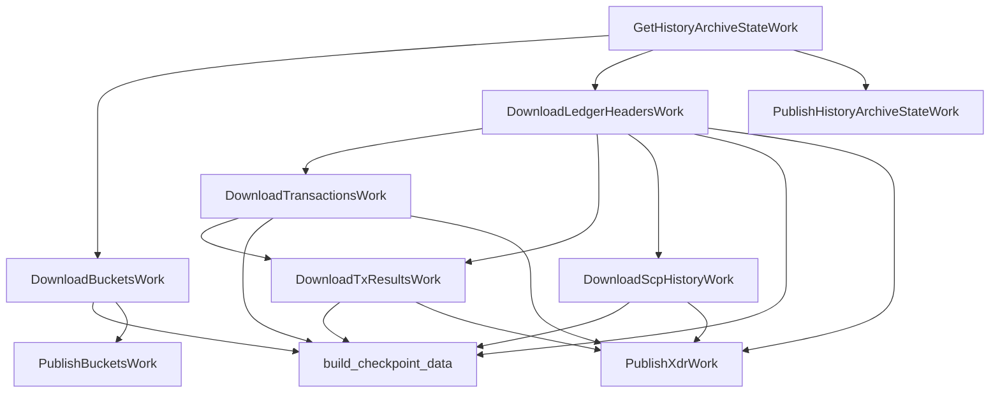

# henyey-historywork

Work items for downloading, verifying, and mirroring Stellar history archive data.

## Overview

`henyey-historywork` packages the history-archive side of catchup into `henyey-work` DAG nodes. It downloads a checkpoint's History Archive State (HAS), buckets, ledger headers, transactions, transaction results, and SCP history, verifies the downloaded payloads, and can mirror that checkpoint back to another archive through an `ArchiveWriter`. It corresponds to stellar-core's `src/historywork/` area, but uses Rust async I/O and an explicit scheduler graph instead of the `BasicWork` class hierarchy and subprocess-based helpers.

## Architecture



## Key Types

| Type | Description |
|------|-------------|
| `HistoryWorkState` | Shared single-checkpoint state holding HAS, bucket directory, downloaded XDR payloads, and progress. |
| `SharedHistoryState` | `Arc<Mutex<HistoryWorkState>>` handle shared across work items. |
| `HistoryWorkStage` | Progress enum covering fetch, download, and publish stages. |
| `HistoryWorkProgress` | Human-readable progress snapshot returned by `get_progress()`. |
| `HistoryWorkBuilder` | Registers the single-checkpoint download DAG and optional publish DAG. |
| `HistoryWorkIds` | Scheduler IDs for HAS, bucket, header, transaction, result, and SCP download work. |
| `PublishWorkIds` | Scheduler IDs for the publish side of the pipeline. |
| `ArchiveWriter` | Output abstraction for publishing history files to an archive destination. |
| `LocalArchiveWriter` | Filesystem-backed `ArchiveWriter` used by tests and local mirroring. |
| `CheckSingleLedgerHeaderWork` | Standalone verifier for one expected ledger header against archive contents. |
| `HistoryFileType` | Category selector for ledger, transactions, results, and SCP files. |
| `CheckpointRange` | Inclusive checkpoint range helper for multi-checkpoint downloads. |
| `BatchDownloadState` | Shared state for range downloads keyed by checkpoint. |
| `BatchDownloadProgress` | Progress counter and message formatter for range downloads. |
| `BatchDownloadWorkBuilder` | Registers the range-download DAG over multiple checkpoints. |

## Usage

```rust
use std::path::PathBuf;
use std::sync::Arc;

use henyey_history::archive::HistoryArchive;
use henyey_historywork::{build_checkpoint_data, HistoryWorkBuilder, SharedHistoryState};
use henyey_work::{WorkScheduler, WorkSchedulerConfig};

let archive = Arc::new(HistoryArchive::new("https://history.stellar.org/prd/core-live/core_live_001/")?);
let state: SharedHistoryState = Default::default();
let builder = HistoryWorkBuilder::new(
    archive,
    63,
    state.clone(),
    PathBuf::from("/tmp/history-buckets"),
);

let mut scheduler = WorkScheduler::new(WorkSchedulerConfig::default());
builder.register(&mut scheduler);
scheduler.run_until_done().await;

let checkpoint = build_checkpoint_data(&state).await?;
assert_eq!(checkpoint.has.current_ledger, 63);
```

```rust
use std::path::PathBuf;
use std::sync::Arc;

use henyey_historywork::{HistoryWorkBuilder, LocalArchiveWriter};

let writer = Arc::new(LocalArchiveWriter::new(PathBuf::from("/var/tmp/history-mirror")));
let download_ids = builder.register(&mut scheduler);
builder.register_publish(&mut scheduler, writer, download_ids);
scheduler.run_until_done().await;
```

```rust
use henyey_historywork::{BatchDownloadWorkBuilder, CheckpointRange};

let builder = BatchDownloadWorkBuilder::new(archive, CheckpointRange::new(64, 256));
let state = builder.state();
builder.register(&mut scheduler);
scheduler.run_until_done().await;

let progress = state.lock().await.progress.clone();
assert_eq!(progress.message(), "downloading scp files: 4/4 checkpoints");
```

## Module Layout

| Module | Description |
|--------|-------------|
| `lib.rs` | Single-file crate containing the download work items, publish work items, shared state types, batch-download helpers, and checkpoint assembly API. |

## Design Notes

- Buckets are verified and written to disk during download so catchup does not keep multi-GB bucket payloads resident in memory.
- Single-checkpoint and batch-download flows share the same archive primitives, but batch mode stores results in maps keyed by checkpoint instead of assembling a single `CheckpointData` value.
- Publish support is currently archive mirroring from downloaded state (`PublishHistoryArchiveStateWork`, `PublishBucketsWork`, `PublishXdrWork`), not stellar-core's full live snapshot publication pipeline.

## stellar-core Mapping

| Rust | stellar-core |
|------|--------------|
| `lib.rs` (`GetHistoryArchiveStateWork`) | `src/historywork/GetHistoryArchiveStateWork.cpp` |
| `lib.rs` (`DownloadBucketsWork`) | `src/historywork/DownloadBucketsWork.cpp` |
| `lib.rs` (`DownloadLedgerHeadersWork`) | `src/historywork/BatchDownloadWork.cpp` |
| `lib.rs` (`DownloadTransactionsWork`) | `src/historywork/BatchDownloadWork.cpp` |
| `lib.rs` (`DownloadTxResultsWork`) | `src/historywork/DownloadVerifyTxResultsWork.cpp` |
| `lib.rs` (`DownloadScpHistoryWork`) | `src/historywork/BatchDownloadWork.cpp` |
| `lib.rs` (`PublishHistoryArchiveStateWork`) | `src/historywork/PutHistoryArchiveStateWork.cpp` |
| `lib.rs` (`PublishBucketsWork`, `PublishXdrWork`) | `src/historywork/PutSnapshotFilesWork.cpp` |
| `lib.rs` (`CheckSingleLedgerHeaderWork`) | `src/historywork/CheckSingleLedgerHeaderWork.cpp` |
| `lib.rs` (`BatchDownloadWork`) | `src/historywork/BatchDownloadWork.cpp` |
| `lib.rs` (`HistoryWorkProgress`, `BatchDownloadProgress`) | `src/historywork/Progress.cpp` |

## Parity Status

See [PARITY_STATUS.md](PARITY_STATUS.md) for detailed stellar-core parity analysis.
