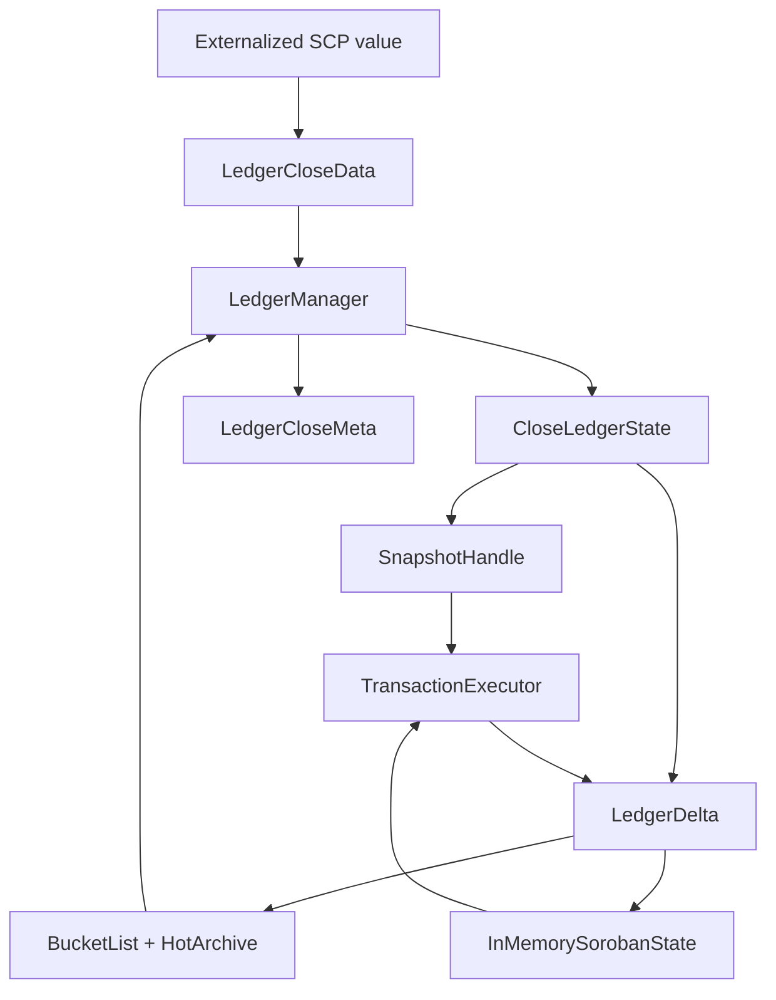

# henyey-ledger

Ledger state management and ledger-close orchestration for henyey.

## Overview

`henyey-ledger` owns the in-memory and bucket-backed view of ledger state, drives ledger close from SCP-externalized inputs, and produces the hashes, metadata, and cache updates that become the next canonical ledger. It sits between consensus-facing code that delivers transaction sets and upgrades, storage-facing code in `henyey-bucket`, and transaction execution in `henyey-tx`. For parity work it maps primarily to stellar-core's `src/ledger/` code, especially `LedgerManagerImpl`, `LedgerTxn` (merged-read subset only), `LedgerHeaderUtils`, and the Soroban in-memory ledger helpers.

## Architecture



## Key Types

| Type | Description |
|------|-------------|
| `LedgerManager` | Top-level coordinator for initialization, ledger close, cache maintenance, and bucket list updates. |
| `LedgerManagerConfig` | Runtime knobs for validation, event/meta emission, and startup scan parallelism. |
| `LedgerCloseData` | Input to a close: ledger sequence, transaction set, close time, upgrades, and optional SCP history. |
| `TransactionSetVariant` | Classic or generalized transaction set, including canonical sorting helpers. |
| `LedgerCloseResult` | Output of a successful close, including the new header, result pairs, optional meta, and perf stats. |
| `LedgerCloseStats` | Aggregate counters for transaction execution and state changes during close. |
| `CloseLedgerState` | Flat merged-read wrapper over a `SnapshotHandle` and `LedgerDelta` for ledger close. Reads resolve current delta → base snapshot. Provides a `ChangeCheckpoint` API for per-upgrade entry change extraction. |
| `ChangeCheckpoint` | Lightweight marker returned by `CloseLedgerState::change_checkpoint()` to extract entry changes made during an upgrade sub-phase. |
| `EntryReader` | Trait for generic ledger entry reads; implemented by `SnapshotHandle` and `CloseLedgerState`. |
| `LedgerDelta` | Per-ledger accumulator for creates, updates, deletes, fee-pool deltas, and coin deltas. |
| `EntryChange` | Net effect for a single ledger key after delta coalescing. |
| `LedgerSnapshot` | Immutable point-in-time ledger state used for validation and execution reads. |
| `SnapshotHandle` | Shared snapshot wrapper with lazy point lookups, batch prefetch, and indexed helpers. |
| `ClassicMarketSnapshot` | Immutable, complete offer and liquidity-pool view tied to one committed ledger sequence, hash, and protocol version. |
| `CommittedMarketEvent` | Generation-tagged initialization/reset/ordinary committed market event with an exact snapshot, metadata-complete offer deltas, and a compact pool-count delta. |
| `CommittedMarketSubscription` | Atomic subscribe-plus-bootstrap handle backed by a four-event non-blocking broadcast ring. Consumers must handle lag explicitly. |
| `IsolatedClassicSimulationBase` | Freezes a caller-selected, metadata-complete offer set once and executes signed Classic envelopes with private ledger and offer overlays. |
| `simulate_classic_transaction` | One-shot convenience API for exact, read-only Classic transaction execution against a committed snapshot. |
| `ConfigUpgradeSetFrame` | Loader, validator, and applier for Soroban config-upgrade sets stored in ledger state. |
| `InMemorySorobanState` | O(1) cache of contract data, code, TTLs, and config settings for Soroban execution. |
| `SorobanNetworkInfo` | `/sorobaninfo`-style view of ledger-configured Soroban limits and fee parameters. |
| `OfferDescriptor` | Lightweight DEX offer ordering key based on price and offer ID. |
| `LedgerError` | Unified error type for initialization, validation, snapshot, and close failures. |

## Usage

### Initialize and close a ledger

```rust
use henyey_common::Hash256;
use henyey_ledger::{LedgerCloseData, LedgerManager, LedgerManagerConfig, TransactionSetVariant};

let manager = LedgerManager::new("Test SDF Network ; September 2015".to_string(), LedgerManagerConfig::default());

let bucket_list = todo!();
let hot_archive = todo!();
let header = todo!();
let header_hash = Hash256::ZERO;
manager.initialize(bucket_list, hot_archive, header, header_hash)?;

let tx_set = TransactionSetVariant::Classic(todo!());
let close_data = LedgerCloseData::new(manager.current_ledger_seq() + 1, tx_set, 1_700_000_000, manager.current_header_hash());
let result = manager.close_ledger(close_data)?;
assert_eq!(result.ledger_seq(), manager.current_ledger_seq());
# Ok::<(), henyey_ledger::LedgerError>(())
```

### Work with snapshots and prefetched entries

```rust
use henyey_ledger::{LedgerSnapshot, SnapshotHandle};
use stellar_xdr::curr::LedgerKey;

let snapshot = LedgerSnapshot::empty(42);
let handle = SnapshotHandle::new(snapshot);

let key: LedgerKey = todo!();
let maybe_entry = handle.get_entry(&key)?;
assert!(maybe_entry.is_none());
# Ok::<(), henyey_ledger::LedgerError>(())
```

### Use ledger helpers for reserves

```rust
use henyey_ledger::reserves;
use stellar_xdr::curr::AccountEntry;

let account: AccountEntry = todo!();

let min_balance = reserves::minimum_balance(&account, 5_000_000);
let available = reserves::available_to_send(&account, 5_000_000);

assert!(available <= account.balance - min_balance);
```

## Module Layout

| Module | Description |
|--------|-------------|
| `lib.rs` | Public exports plus lightweight reserve and trustline helpers. |
| `manager.rs` | `LedgerManager`, startup cache scans, bucket-list installation, and close/commit orchestration. |
| `close.rs` | Ledger-close inputs and outputs, transaction-set preparation, upgrade context, and perf/stat structs. |
| `delta.rs` | Change coalescing, fee deduction helpers, and bucket-update categorization. |
| `close_state.rs` | `CloseLedgerState` merged-read wrapper with checkpoint-based per-upgrade change extraction. |
| `snapshot.rs` | Immutable snapshots, lazy lookup handles, batch prefetch, and snapshot construction. |
| `header.rs` | Header hashing, skip-list maintenance, chain verification, and next-header construction. |
| `error.rs` | Crate-wide error enum. |
| `config_upgrade.rs` | Soroban config-upgrade loading, validation, and application. |
| `soroban_state.rs` | In-memory contract data/code/TTL cache with rent-size accounting. |
| `offer.rs` | Offer ordering primitives and asset-pair utilities. |
| `offer_store.rs` | Re-export of the shared offer store implementation from `henyey-tx`. |
| `prepare_liabilities.rs` | Liability migration and cleanup logic for protocol/base-reserve upgrades. |
| `memory_report.rs` | RSS/jemalloc/component memory reporting helpers. |
| `execution/mod.rs` | `TransactionExecutor`, transaction lifecycle, hot-archive lookup, and execution result types. |
| `execution/config.rs` | Loading Soroban config settings and fee parameters from ledger entries. |
| `execution/meta.rs` | Building `TransactionMeta` and tracking restored entries for CAP-0066-style metadata. |
| `execution/result_mapping.rs` | Mapping execution failures to XDR transaction result payloads. |
| `execution/signatures.rs` | Signature verification, threshold checks, and fee-bump inner-hash handling. |
| `execution/tx_set.rs` | Sequential and parallel transaction-set execution, fee pre-deduction, and cluster orchestration. |

## Design Notes

### Delta coalescing

`LedgerDelta` records the net effect per ledger key rather than every intermediate mutation. Create-then-delete annihilates to no change, delete-then-create becomes an update, and repeated updates preserve the original pre-state while replacing the final post-state. This mirrors stellar-core `LedgerTxn` merge semantics and keeps bucket-list output deterministic.

### Close-time ledger state (CloseLedgerState)

`CloseLedgerState` is a flat merged-read wrapper over a `SnapshotHandle` and a mutable `LedgerDelta`. Every read resolves: current delta → base snapshot, making stale reads structurally impossible during upgrade and prepare-liabilities phases. Per-upgrade entry change extraction uses explicit checkpoints (`change_checkpoint()` / `entry_changes_since()`) rather than nested transaction scopes. The `EntryReader` trait abstracts over `SnapshotHandle` and `CloseLedgerState` so that config-loading functions work in both the close pipeline (via `CloseLedgerState`) and the history replay path (via `SnapshotHandle`).

Note: the execution layer (parallel Soroban, fee deduction) intentionally continues to operate on the decomposed `(SnapshotHandle, LedgerDelta)` primitives for `Send + Sync` parallel tasks — this is an architectural boundary, not a bug.

### Pre-deducted fees and staged execution

The close pipeline can deduct fees before transaction bodies run, including across classic and Soroban phases. Parallel Soroban clusters then execute with isolated executors and merge back into the main delta, while preserving the fee and sequence-number behavior expected by stellar-core.

### Restored entries are tracked explicitly

When Soroban restores entries from the live bucket list or hot archive, metadata emission distinguishes `RESTORED` from normal `CREATED` or `UPDATED` changes. That keeps transaction meta aligned with CAP-0066 and upstream `TransactionMeta` behavior.

### Committed market stream

`subscribe_committed_market()` subscribes before capturing an immutable baseline
under `committed_state_gate`; callers scan the baseline after the gate is
released while closes buffer. Initialization is published only after bucket
state, offer caches, Soroban configuration, and header/hash agree. Ordinary
publication occurs at the same commit boundary and never awaits a consumer.
Reset and reinitialization advance the stream generation. The fixed ring
capacity is intentionally four because retained snapshots pin bucket and
Soroban resources; broadcast lag is reported rather than silently skipped.
Snapshot bucket hashes remain garbage-collection roots until every shared
handle releases its lookup closures or is dropped. Extraction and snapshot
construction are skipped when there are no subscribers.

**Accumulation hazard**: an observer that retains successive snapshots (the
bootstrap baseline plus each ledger event's snapshot) pins the *union* of every
bucket file those snapshots reference — across bucket-list spills and even
`reset()` — until it drops the handles or calls `release_lookups()`. There is
no internal cap on this retention. The gauge `henyey_snapshot_gc_pinned_hashes`
exports the number of distinct bucket hashes currently pinned as snapshot GC
roots; a monotonically growing value under a live subscriber indicates a
consumer that is holding old snapshots instead of releasing them.

Publication qualification:

```bash
HENYEY_MARKET_PUBLICATION_SNAPSHOT_OFFERS=1250000 \
HENYEY_MARKET_PUBLICATION_CHANGES=2000 HENYEY_MARKET_PUBLICATION_LEDGERS=1000 \
cargo test --release -p henyey-ledger benchmark_committed_market_publication_with_active_subscriber -- --ignored --nocapture
```

### Isolated Classic simulation

`IsolatedClassicSimulationBase` is a generic execution integration point for
external consumers. The caller supplies a signed `TransactionEnvelope`, private
ledger-entry overrides, and the complete offer records that transaction may
cross. Henyey executes the envelope through the normal transaction executor at
LCL+1, returning the exact result, operation results, transaction meta, fee, and
net ledger changes. A prepared immutable offer base is shared across simulations;
each call receives a fresh copy-on-write offer overlay. Canonical ledger state,
the canonical offer store, and caches owned by the source snapshot are never
mutated. Transaction construction and strategy policy deliberately remain with
the caller.

## stellar-core Mapping

| Rust | stellar-core |
|------|--------------|
| `manager.rs` | `src/ledger/LedgerManagerImpl.cpp`, `src/ledger/LedgerManagerImpl.h` |
| `close.rs` | `src/ledger/LedgerCloseMetaFrame.cpp`, `src/ledger/LedgerCloseMetaFrame.h`, parts of `LedgerManagerImpl.cpp` |
| `delta.rs` | `src/ledger/LedgerTxn.cpp`, `src/ledger/LedgerTxn.h` |
| `close_state.rs` | `src/ledger/LedgerTxn.h`, `src/ledger/LedgerTxn.cpp` (merged-read subset; nesting replaced by flat checkpoint API) |
| `snapshot.rs` | `src/ledger/LedgerStateSnapshot.cpp`, `src/ledger/LedgerStateSnapshot.h` |
| `header.rs` | `src/ledger/LedgerHeaderUtils.cpp`, `src/ledger/LedgerHeaderUtils.h`, bucket skip-list helpers |
| `execution/mod.rs` | Transaction-apply path in `src/ledger/LedgerManagerImpl.cpp` plus `src/transactions/*` integration points |
| `execution/config.rs` | `src/main/Config.cpp`-style Soroban fee/config bridging and `src/ledger/NetworkConfig.cpp` reads |
| `execution/meta.rs` | `src/ledger/TransactionMeta.cpp` and ledger-close meta assembly |
| `execution/result_mapping.rs` | Transaction-result construction in `src/transactions/TransactionFrame.cpp` |
| `execution/signatures.rs` | Signature and threshold checks in `src/transactions/TransactionFrame.cpp` and operation frames |
| `execution/tx_set.rs` | Generalized tx-set apply flow in `src/ledger/LedgerManagerImpl.cpp` and `src/herder/TxSetFrame.cpp` |
| `config_upgrade.rs` | `src/ledger/NetworkConfig.cpp`, `src/ledger/NetworkConfig.h`, `src/herder/Upgrades.cpp` |
| `soroban_state.rs` | `src/ledger/InMemorySorobanState.cpp`, `src/ledger/InMemorySorobanState.h` |
| `prepare_liabilities.rs` | `src/herder/Upgrades.cpp` |
| `offer.rs` | Offer ordering helpers in `src/ledger/LedgerTxn.cpp` and related DEX utilities |
| `memory_report.rs` | No direct upstream equivalent; henyey-specific observability |

## Parity Status

See [PARITY_STATUS.md](PARITY_STATUS.md) for detailed stellar-core parity analysis.
