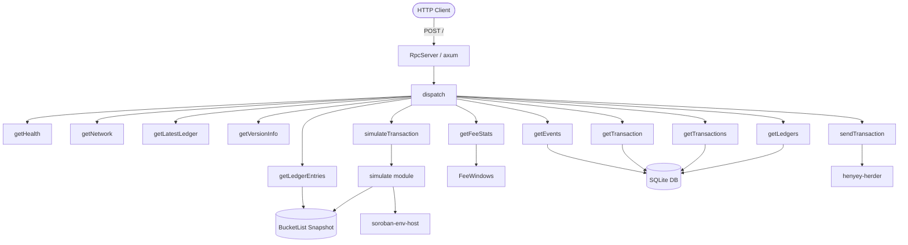

# henyey-rpc

Stellar JSON-RPC 2.0 server implementing the Soroban RPC API.

## Overview

`henyey-rpc` exposes henyey's ledger state and transaction submission over
a JSON-RPC 2.0 HTTP endpoint. It is the primary interface used by wallets,
SDKs, and dApps to interact with a henyey node, mirroring the API surface
of Stellar's standalone `soroban-rpc` service.

The crate is consumed by the `henyey` binary, which constructs an `RpcServer`
and starts it alongside the rest of the node. Internally it depends on
`henyey-app` for ledger state and lifecycle, `henyey-db` for historical
queries, `henyey-bucket` for bucket list snapshots, `henyey-herder` for
transaction submission, `henyey-ledger` for `SorobanNetworkInfo`,
`henyey-tx` for transaction frame helpers, `henyey-crypto` for hashing,
`henyey-common` for shared types, and `soroban-env-host-p25` for Soroban
transaction simulation.

## Architecture



## Key Types

| Type | Description |
|------|-------------|
| `RpcServer` | Public entry point; binds an HTTP listener and serves JSON-RPC requests |
| `RpcContext` | Shared state (`Arc<App>`, `Arc<FeeWindows>`) passed to every handler via axum state |
| `JsonRpcRequest` | Deserialized JSON-RPC 2.0 request envelope |
| `JsonRpcResponse` | Serialized JSON-RPC 2.0 response envelope (result or error) |
| `JsonRpcError` | Standard JSON-RPC 2.0 error object with code, message, optional data |
| `BucketListSnapshotSource` | Adapter implementing soroban-host `SnapshotSource` over a bucket list snapshot |

## Usage

### Starting the server

```rust
use std::sync::Arc;
use henyey_rpc::RpcServer;

let server = RpcServer::new(8000, app.clone());
server.start().await?;
// Server listens on 0.0.0.0:8000 and shuts down via App's shutdown signal.
```

### Querying the endpoint

```bash
curl -X POST http://localhost:8000 \
  -H 'Content-Type: application/json' \
  -d '{"jsonrpc":"2.0","id":1,"method":"getHealth"}'
```

### Simulating a transaction

```bash
curl -X POST http://localhost:8000 \
  -H 'Content-Type: application/json' \
  -d '{
    "jsonrpc":"2.0",
    "id":1,
    "method":"simulateTransaction",
    "params":{"transaction":"<base64-encoded TransactionEnvelope>"}
  }'
```

## Module Layout

| Module | Description |
|--------|-------------|
| `lib.rs` | Crate root; re-exports `RpcServer` |
| `server.rs` | Axum HTTP server setup, request parsing, version validation |
| `context.rs` | `RpcContext` struct holding shared `Arc<App>` |
| `dispatch.rs` | Method name routing to handler functions |
| `error.rs` | `JsonRpcError` type and standard error code constructors |
| `types/jsonrpc.rs` | `JsonRpcRequest` / `JsonRpcResponse` serde types |
| `util.rs` | Shared helpers: TOID encoding, pagination validation, tx status, TTL key construction, xdrFormat support, timestamp formatting |
| `fee_window.rs` | Fee distribution computation, ring buffer, sliding window fee stats |
| `methods/health.rs` | `getHealth` — returns server status and ledger window |
| `methods/network.rs` | `getNetwork` — returns passphrase and protocol version |
| `methods/latest_ledger.rs` | `getLatestLedger` — returns latest ledger sequence, hash, close time, header/meta XDR |
| `methods/version_info.rs` | `getVersionInfo` — returns node version metadata |
| `methods/fee_stats.rs` | `getFeeStats` — returns fee percentile statistics from sliding window |
| `methods/get_ledger_entries.rs` | `getLedgerEntries` — reads entries from bucket list snapshot with TTL lookup |
| `methods/get_transaction.rs` | `getTransaction` — looks up a transaction by hash from the database |
| `methods/get_transactions.rs` | `getTransactions` — paginated range query over transactions with TOID cursor |
| `methods/get_ledgers.rs` | `getLedgers` — paginated range query over ledgers with header/meta XDR |
| `methods/get_events.rs` | `getEvents` — queries contract events with filters and pagination |
| `methods/send_transaction.rs` | `sendTransaction` — submits a transaction envelope to the herder |
| `methods/simulate_transaction.rs` | `simulateTransaction` — delegates to the simulate module |
| `simulate/mod.rs` | Soroban simulation: InvokeHostFunction, ExtendTTL, Restore; resource adjustment, fee computation |
| `simulate/snapshot.rs` | `BucketListSnapshotSource` — soroban-host `SnapshotSource` adapter with filtered/unfiltered access |

## Design Notes

- **Single endpoint**: All methods share a single `POST /` endpoint. Axum
  deserializes the body, `dispatch` routes by method name, and each handler
  returns `Result<Value, JsonRpcError>` which is wrapped into a JSON-RPC
  response envelope.

- **Simulation is blocking**: Soroban's `Host` uses `Rc` internally and is
  not `Send`. Simulation runs inside `tokio::task::spawn_blocking` to avoid
  holding the async runtime.

- **Resource adjustment**: `simulateTransaction` applies the same adjustment
  factors as `soroban-simulation` (1.04x + 50k for CPU instructions, 1.15x
  for refundable fees) to give transactions headroom against state drift.

- **ExtendTTL/Restore simulation**: `simulateTransaction` handles all three
  Soroban operation types. ExtendTTL and Restore simulations compute rent
  fees by looking up entries and TTLs from the bucket list snapshot, mirroring
  `soroban-simulation`'s `simulate_extend_ttl_op_resources` and
  `simulate_restore_op_resources`.

- **xdrFormat support**: All methods support `xdrFormat: "json"` parameter
  which returns XDR fields as native JSON objects (via `stellar-xdr` serde
  support) instead of base64-encoded strings. Field names change
  (`envelopeXdr` → `envelopeJson`, etc.) matching upstream behavior.

- **Fee window**: `FeeWindows` maintains two independent sliding windows
  (classic and Soroban) backed by ring buffers. A background poller reads
  new LCMs from the database every second, avoiding coupling with the
  ledger close path. Fee distributions use nearest-rank percentile
  computation matching the upstream Go implementation.

- **Visibility**: All internal modules and types are `pub(crate)`. Only
  `RpcServer` is exported from the crate.

## Configuration

The RPC server is controlled by the `[rpc]` section in the node config:

```toml
[rpc]
enabled = true
port = 8000
retention_window = 2880
max_healthy_ledger_latency_secs = 30
```

| Option | Type | Default | Description |
|--------|------|---------|-------------|
| `enabled` | `bool` | `false` | Enable the JSON-RPC server |
| `port` | `u16` | `8000` | HTTP listen port |
| `retention_window` | `u32` | `2880` | Ledgers retained for range queries (~4 hours at 5s close) |
| `max_healthy_ledger_latency_secs` | `u64` | `30` | Max ledger age before `getHealth` reports unhealthy (0 disables) |

The server is **disabled by default**. Set `enabled = true` in the `[rpc]`
section of your config to start it.

## HTTP API Specification

### Transport

| Property | Value |
|----------|-------|
| Method | `POST` only |
| Endpoint | `/` (single route) |
| Body limit | 512 KB (524,288 bytes) |
| Content type | JSON |
| Batch requests | Not supported (returns `invalid_request` if body starts with `[`) |
| HTTP status | Always `200 OK`, even for JSON-RPC errors |

### JSON-RPC 2.0 Envelope

**Request**:

```json
{
  "jsonrpc": "2.0",
  "id": 1,
  "method": "<method_name>",
  "params": { ... }
}
```

`jsonrpc` must be exactly `"2.0"`. `id` may be a number, string, or null.
`params` is optional and defaults to null when omitted.

**Success response**:

```json
{
  "jsonrpc": "2.0",
  "id": 1,
  "result": { ... }
}
```

**Error response**:

```json
{
  "jsonrpc": "2.0",
  "id": 1,
  "error": {
    "code": -32600,
    "message": "description",
    "data": null
  }
}
```

The `result` field is omitted when `error` is present and vice versa.
The `data` field on errors is omitted when null.

### Request Validation Order

1. **Batch detection** — body starts with `[` → `invalid_request("batch requests are not supported")`, `id: null`
2. **JSON parsing** — malformed JSON or missing fields → `invalid_request("invalid JSON: ...")`, `id: null`
3. **Version check** — `jsonrpc != "2.0"` → `invalid_request("jsonrpc must be \"2.0\"")`, parsed `id`
4. **Method dispatch** — unknown method → `method_not_found("method not found: <name>")`
5. **Parameter validation** — each handler validates its own params → `invalid_params`

### Error Codes

| Code | Name | Triggers |
|------|------|----------|
| `-32600` | Invalid request | Batch requests, malformed JSON, wrong jsonrpc version |
| `-32601` | Method not found | Unknown method name |
| `-32602` | Invalid params | Invalid, missing, or out-of-range parameters |
| `-32603` | Internal error | Server-side failures (DB errors, XDR encoding, missing snapshots) |

### xdrFormat Parameter

Many methods accept an optional `xdrFormat` parameter:

| Value | Behavior |
|-------|----------|
| `"xdr"` (default) | XDR values are base64-encoded strings |
| `"json"` | XDR values are serialized as JSON objects |

Any other value returns `invalid_params("unsupported xdrFormat")`.

**Field naming in base64 vs JSON mode**:

| Context | Base64 mode | JSON mode |
|---------|-------------|-----------|
| Most methods | `{name}Xdr` (e.g. `envelopeXdr`) | `{name}Json` (e.g. `envelopeJson`) |
| `simulateTransaction` | `{name}` unsuffixed (e.g. `transactionData`) | `{name}Json` (e.g. `transactionDataJson`) |
| `getLedgerEntries` key/data | `key`, `xdr` (unsuffixed) | `keyJson`, `dataJson` |

### Pagination

Used by `getTransactions`, `getLedgers`, and `getEvents`.

- `startLedger` and `pagination.cursor` are **mutually exclusive** — providing
  both returns `invalid_params`
- One of the two is required (except `getEvents` where `startLedger` is always required)
- `pagination.limit` defaults to a method-specific value, clamped to `[1, max]`

**Cursor formats**:

| Method | Cursor format | Default limit | Max limit |
|--------|---------------|---------------|-----------|
| `getTransactions` | TOID string (see below) | 10 | 200 |
| `getLedgers` | Ledger sequence string | 5 | 200 |
| `getEvents` | Event ID string | 100 | 10,000 |

**TOID (Total Order ID)** encodes a 64-bit integer as a decimal string:
bits 63–32 = ledger sequence, bits 31–12 = tx order (1-based), bits 11–0 = op index.

---

### Methods

#### `getHealth`

Returns server health and ledger window.

**Parameters**: None.

| Response field | Type | Description |
|----------------|------|-------------|
| `status` | string | `"healthy"` or `"unhealthy"` based on ledger age vs `max_healthy_ledger_latency_secs` |
| `latestLedger` | number | Latest ledger sequence |
| `oldestLedger` | number | Oldest available ledger sequence |
| `ledgerRetentionWindow` | number | Configured retention window |

#### `getNetwork`

Returns network identity.

**Parameters**: None.

| Response field | Type | Description |
|----------------|------|-------------|
| `friendbotUrl` | string | Friendbot URL (testnet only, empty string otherwise) |
| `passphrase` | string | Network passphrase |
| `protocolVersion` | number | Current protocol version |

#### `getLatestLedger`

Returns the latest closed ledger.

**Parameters**: None.

| Response field | Type | Description |
|----------------|------|-------------|
| `id` | string | Ledger hash (hex) |
| `protocolVersion` | number | Protocol version |
| `sequence` | number | Ledger sequence |
| `closeTime` | string | Close time (decimal string) |
| `headerXdr` | string | Base64-encoded `LedgerHeader` |
| `metadataXdr` | string | Base64-encoded `LedgerCloseMeta` (empty if unavailable) |

Does not support `xdrFormat`.

#### `getVersionInfo`

Returns build information.

**Parameters**: None.

| Response field | Type | Description |
|----------------|------|-------------|
| `version` | string | Application version |
| `commitHash` | string | Git commit hash |
| `buildTimestamp` | string | Build timestamp |
| `captiveCoreVersion` | string | `"henyey-v{version}"` |
| `protocolVersion` | number | Protocol version |

#### `getFeeStats`

Returns fee percentile distributions from a sliding window.

**Parameters**: None.

| Response field | Type | Description |
|----------------|------|-------------|
| `sorobanInclusionFee` | object | Soroban fee distribution |
| `inclusionFee` | object | Classic fee-per-operation distribution |
| `latestLedger` | number | Latest ledger |

**Fee distribution object** (both `sorobanInclusionFee` and `inclusionFee`):

| Field | Type | Description |
|-------|------|-------------|
| `max`, `min`, `mode` | string | Max, min, and most frequent fee |
| `p10`..`p99` | string | Percentiles: 10, 20, 30, 40, 50, 60, 70, 80, 90, 95, 99 |
| `transactionCount` | string | Transactions in window |
| `ledgerCount` | number | Ledgers in window |

All fee values are strings. Percentiles use nearest-rank:
`kth = ceil(p * count / 100)`, `value = sorted[kth - 1]`. Classic fee =
`feeCharged / numOps`. Soroban inclusion fee = `feeCharged - (nonRefundable + refundable)`.

#### `getLedgerEntries`

Reads entries from the bucket list snapshot.

| Parameter | Type | Required | Constraints |
|-----------|------|----------|-------------|
| `keys` | string[] | yes | Base64-encoded `LedgerKey` XDR. Non-empty, max 200. |
| `xdrFormat` | string | no | `"xdr"` or `"json"` |

| Response field | Type | Description |
|----------------|------|-------------|
| `entries` | array | Found entries (missing keys silently omitted) |
| `latestLedger` | number | Snapshot ledger |

**Entry object**:

| Field (base64) | Field (json) | Type | Description |
|-----------------|--------------|------|-------------|
| `key` | `keyJson` | string/object | Echoed ledger key |
| `xdr` | `dataJson` | string/object | `LedgerEntryData` |
| `lastModifiedLedgerSeq` | same | number | Last modified ledger |
| `extXdr` | `extJson` | string/object | `LedgerEntryExt` |
| `liveUntilLedgerSeq` | same | number | TTL (ContractData/ContractCode only) |

#### `getTransaction`

Looks up a single transaction by hash.

| Parameter | Type | Required | Constraints |
|-----------|------|----------|-------------|
| `hash` | string | yes | Transaction hash (hex) |
| `xdrFormat` | string | no | `"xdr"` or `"json"` |

**When found**:

| Field (base64) | Field (json) | Type | Description |
|-----------------|--------------|------|-------------|
| `status` | same | string | `"SUCCESS"` or `"FAILED"` |
| `latestLedger` | same | number | Latest ledger |
| `latestLedgerCloseTime` | same | string | Decimal string |
| `oldestLedger` | same | number | Oldest ledger |
| `oldestLedgerCloseTime` | same | string | Decimal string |
| `ledger` | same | number | Containing ledger |
| `createdAt` | same | string | Close time (decimal string) |
| `applicationOrder` | same | number | 1-based position |
| `feeBump` | same | boolean | Fee bump flag |
| `envelopeXdr` | `envelopeJson` | string/object | `TransactionEnvelope` |
| `resultXdr` | `resultJson` | string/object | `TransactionResult` |
| `resultMetaXdr` | `resultMetaJson` | string/object | `TransactionMeta` |
| `diagnosticEventsXdr` | `diagnosticEventsJson` | array | `DiagnosticEvent[]` (if present) |

**When not found**: returns `status: "NOT_FOUND"` with only the ledger window fields.

#### `getTransactions`

Paginated range query over transactions.

| Parameter | Type | Required | Constraints |
|-----------|------|----------|-------------|
| `startLedger` | number | conditional | Must be in `[oldest, latest]`. Mutually exclusive with cursor. |
| `pagination.cursor` | string | conditional | TOID string. Mutually exclusive with startLedger. |
| `pagination.limit` | number | no | Default 10, max 200 |
| `status` | string | no | Filter: `"SUCCESS"` or `"FAILED"` |
| `xdrFormat` | string | no | `"xdr"` or `"json"` |

| Response field | Type | Description |
|----------------|------|-------------|
| `transactions` | array | Transaction objects |
| `latestLedger` | number | Latest ledger |
| `latestLedgerCloseTime` | string | Decimal string |
| `oldestLedger` | number | Oldest ledger |
| `oldestLedgerCloseTime` | string | Decimal string |
| `cursor` | string | TOID of last result (empty if none) |

Each transaction object has the same shape as `getTransaction` results
except `createdAt` is a **number** (not a string) and includes a `txHash` field.

#### `getLedgers`

Paginated range query over ledgers.

| Parameter | Type | Required | Constraints |
|-----------|------|----------|-------------|
| `startLedger` | number | conditional | Must be in `[oldest, latest]`. Mutually exclusive with cursor. |
| `pagination.cursor` | string | conditional | Ledger sequence string. Mutually exclusive with startLedger. |
| `pagination.limit` | number | no | Default 5, max 200 |
| `xdrFormat` | string | no | `"xdr"` or `"json"` |

| Response field | Type | Description |
|----------------|------|-------------|
| `ledgers` | array | Ledger objects |
| `latestLedger` | number | Latest ledger |
| `latestLedgerCloseTime` | string | Decimal string |
| `oldestLedger` | number | Oldest ledger |
| `oldestLedgerCloseTime` | string | Decimal string |
| `cursor` | string | Sequence of last result (empty if none) |

**Ledger object**:

| Field (base64) | Field (json) | Type | Description |
|-----------------|--------------|------|-------------|
| `hash` | same | string | Ledger hash (hex) |
| `sequence` | same | number | Ledger sequence |
| `ledgerCloseTime` | same | string | Close time (decimal string) |
| `headerXdr` | `headerJson` | string/object | `LedgerHeaderHistoryEntry` |
| `metadataXdr` | `metadataJson` | string/object | `LedgerCloseMeta` |

#### `getEvents`

Queries contract events with filters and pagination.

| Parameter | Type | Required | Constraints |
|-----------|------|----------|-------------|
| `startLedger` | number | yes | Starting ledger sequence |
| `endLedger` | number | no | Ending ledger (exclusive) |
| `filters` | array | no | Max 5 filter objects |
| `pagination.cursor` | string | no | Event ID cursor |
| `pagination.limit` | number | no | Default 100, max 10,000 |
| `xdrFormat` | string | no | `"xdr"` or `"json"` |

**Filter object**:

| Field | Type | Constraints |
|-------|------|-------------|
| `type` | string | `"contract"` or `"system"` (`"diagnostic"` is rejected) |
| `contractIds` | string[] | Max 5 per filter |
| `topics` | string[][] | Max 5 segments, each with max 4 alternatives. `"*"` = wildcard, `"**"` = match remaining. |

| Response field | Type | Description |
|----------------|------|-------------|
| `events` | array | Event objects |
| `cursor` | string | Event ID of last result (empty if none) |
| `latestLedger` | number | Latest ledger |
| `latestLedgerCloseTime` | string | Decimal string |
| `oldestLedger` | number | Oldest ledger |
| `oldestLedgerCloseTime` | string | ISO 8601 UTC timestamp |

**Event object**:

| Field (base64) | Field (json) | Type | Description |
|-----------------|--------------|------|-------------|
| `type` | same | string | `"contract"`, `"system"`, or `"diagnostic"` |
| `ledger` | same | number | Containing ledger |
| `ledgerClosedAt` | same | string | ISO 8601 UTC timestamp |
| `id` | same | string | Unique event ID |
| `operationIndex` | same | number | Operation index |
| `transactionIndex` | same | number | Transaction index |
| `txHash` | same | string | Transaction hash |
| `inSuccessfulContractCall` | same | boolean | Whether in successful call |
| `contractId` | same | string | Contract ID (or empty) |
| `value` | `valueJson` | string/object | Event value (`ScVal`) |
| `topic` | `topicJson` | array | Topic entries (`ScVal[]`) |

Note: event timestamps use ISO 8601 format, unlike other methods that use
decimal strings.

#### `sendTransaction`

Submits a transaction to the network.

| Parameter | Type | Required | Constraints |
|-----------|------|----------|-------------|
| `transaction` | string | yes | Base64-encoded `TransactionEnvelope` |
| `xdrFormat` | string | no | `"xdr"` or `"json"` |

| Response field (base64) | Response field (json) | Type | Description |
|--------------------------|----------------------|------|-------------|
| `hash` | same | string | Transaction hash (hex) |
| `latestLedger` | same | number | Latest ledger |
| `latestLedgerCloseTime` | same | string | Decimal string |
| `status` | same | string | See below |
| `errorResultXdr` | `errorResultJson` | string/object | `TransactionResult` (only on `"ERROR"`) |
| `diagnosticEventsXdr` | `diagnosticEventsJson` | array | Empty `[]` (only on `"ERROR"`) |

**Status values**:

| Status | Meaning |
|--------|---------|
| `PENDING` | Accepted into the queue |
| `DUPLICATE` | Already in queue |
| `TRY_AGAIN_LATER` | Queue full or rate limited |
| `ERROR` | Invalid, banned, fee too low, or filtered |

#### `simulateTransaction`

Simulates a Soroban transaction without submitting it.

| Parameter | Type | Required | Constraints |
|-----------|------|----------|-------------|
| `transaction` | string | yes | Base64-encoded `TransactionEnvelope`. Must contain exactly one Soroban op. V0 envelopes rejected. Fee bumps unwrapped. |
| `xdrFormat` | string | no | `"xdr"` or `"json"` |
| `authMode` | string | no | `"enforce"`, `"record"`, or `"record_allow_nonroot"`. Only for `InvokeHostFunction`. |
| `resourceConfig.instructionLeeway` | number | no | Additive CPU padding. Effective leeway = `max(50000, value)`. |

**`authMode` behavior**:

| Value | Behavior |
|-------|----------|
| `"enforce"` | Use auth entries from the transaction |
| `"record"` | Record root-only auth (tx must have no auth entries) |
| `"record_allow_nonroot"` | Record all auth (tx must have no auth entries) |
| *(omitted)* | Enforce if tx has auth entries, record otherwise |

**Response — success (InvokeHostFunction)**:

| Field (base64) | Field (json) | Type | Description |
|-----------------|--------------|------|-------------|
| `transactionData` | `transactionDataJson` | string/object | `SorobanTransactionData` |
| `minResourceFee` | same | string | Minimum resource fee |
| `cost.cpuInsns` | same | string | CPU instructions |
| `cost.memBytes` | same | string | Always `"0"` |
| `latestLedger` | same | number | Latest ledger |
| `events` | `eventsJson` | array | `DiagnosticEvent[]` (if non-empty) |
| `results` | same | array | Single-element: `{ auth, xdr }` (or `authJson`, `xdrJson`) |
| `stateChanges` | same | array | Ledger entry diffs (if non-empty) |

**State change object**:

| Field (base64) | Field (json) | Type | Description |
|-----------------|--------------|------|-------------|
| `type` | same | string | `"created"`, `"updated"`, or `"deleted"` |
| `key` | `keyJson` | string/object | `LedgerKey` |
| `before` | `beforeJson` | string/object/null | `LedgerEntry` before (null if created) |
| `after` | `afterJson` | string/object/null | `LedgerEntry` after (null if deleted) |

**Response — success (ExtendFootprintTtl / RestoreFootprint)**:

Returns `transactionData`, `minResourceFee`, `cost`, and `latestLedger` only.

**Response — simulation error**:

Returned as a successful JSON-RPC response (not a JSON-RPC error):

| Field | Type | Description |
|-------|------|-------------|
| `error` | string | Error message |
| `transactionData` | string | Empty `""` |
| `minResourceFee` | string | `"0"` |
| `cost.cpuInsns` | string | `"0"` |
| `cost.memBytes` | string | `"0"` |
| `latestLedger` | number | Latest ledger |

**Resource adjustment** (InvokeHostFunction):
- Instructions: `max(insns + max(50000, leeway), floor(insns * 1.04))`
- TX size: `max(size + 500, floor(size * 1.1))`
- Refundable fee: 1.15x multiplier

### Method Summary

| Method | Params | xdrFormat | Pagination |
|--------|--------|-----------|------------|
| `getHealth` | — | — | — |
| `getNetwork` | — | — | — |
| `getLatestLedger` | — | — | — |
| `getVersionInfo` | — | — | — |
| `getFeeStats` | — | — | — |
| `getLedgerEntries` | yes | yes | — |
| `getTransaction` | yes | yes | — |
| `getTransactions` | yes | yes | TOID cursor, default 10, max 200 |
| `getLedgers` | yes | yes | Sequence cursor, default 5, max 200 |
| `getEvents` | yes | yes | Event ID cursor, default 100, max 10,000 |
| `sendTransaction` | yes | yes | — |
| `simulateTransaction` | yes | yes | — |

## Test Coverage

| Area | Test Count | File |
|------|-----------|------|
| Simulate pure functions (sim_adjust, resources, auth, extract_op, XDR fields, state changes, fees, tx size) | 44 | `simulate/mod.rs` |
| Utility helpers (TOID, pagination, tx status, timestamps, TTL keys, xdrFormat) | 22 | `util.rs` |
| Fee window (distribution, ring buffer, percentiles, ops counting) | 13 | `fee_window.rs` |
| Server (request parsing, response serialization, batch detection, version validation) | 10 | `server.rs` |
| Snapshot normalization (V0→V3, signers, XDR size) | 8 | `simulate/snapshot.rs` |
| Event filter parsing (empty, wildcards, limits, type rejection) | 8 | `methods/get_events.rs` |
| send_transaction helpers (error result, diagnostic events, error codes) | 3 | `methods/send_transaction.rs` |
| **Total** | **108** | |

All tests are pure unit tests (`#[test]`) that run without network or
database access. No integration tests exist for the RPC server yet.

## stellar-core Mapping

This crate has no direct stellar-core counterpart. It implements the
Stellar RPC API, which in the reference architecture is provided
by the standalone `soroban-rpc` service rather than `stellar-core` itself.
